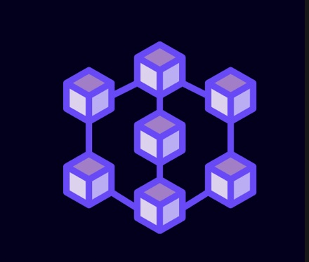

I am very interested in decentralized web-based applications.

This blog will later share the research and development experience of decentralized applications

This blog will be deployed on the IPFS network.

ipns:
`k51qzi5uqu5dhgg7sef38lklh0k9egkp2iywjbkm7qpup5l7cbq858l5mqpcl0`

visit:
`k51qzi5uqu5dhgg7sef38lklh0k9egkp2iywjbkm7qpup5l7cbq858l5mqpcl0.ipns.<your gateway url>`

DNSlink:
`blog.dawngrp.com.ipns.<your gateway url>`

